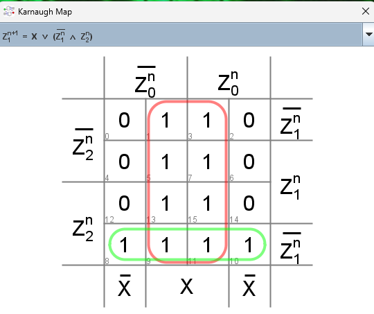

# FSM finding overlapping-sequence 010 or 1001

## Mealy
### Graph

### Truth table and state and output equations

### K-Maps
#### Output

#### Z0n+1

#### Z1n+1

#### Z2n+1

### Circuits
#### D FFs based

#### JK FFs based

#### NAND based

## Moore
### Graph

### Truth table and state and output equations

### K-Maps
#### Output

#### Z0n+1

#### Z1n+1

#### Z2n+1

### Circuits
#### D FFs based

#### JK FFs based

#### NAND based
